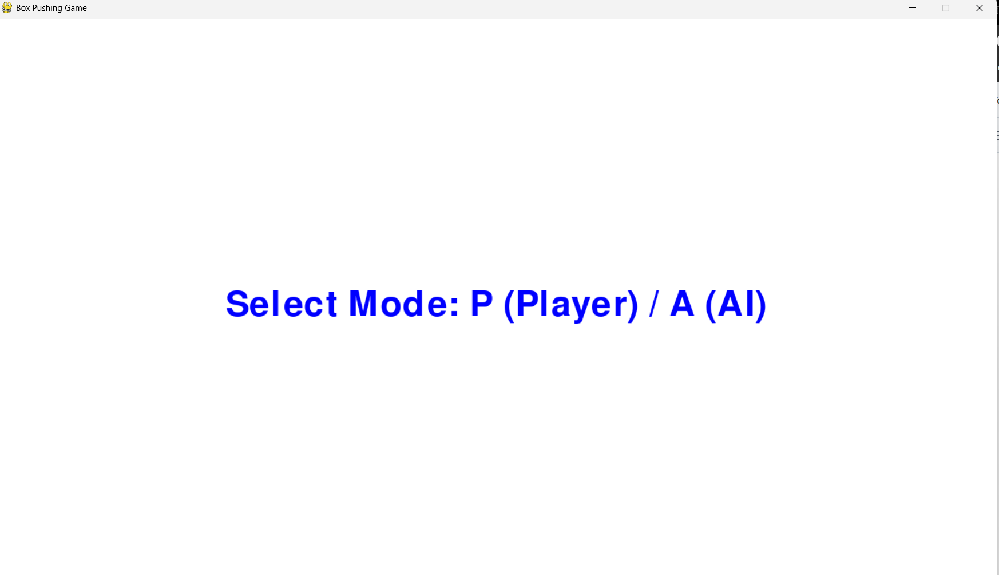
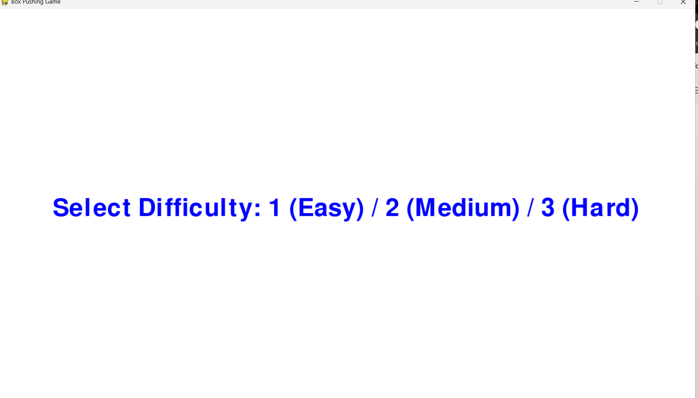
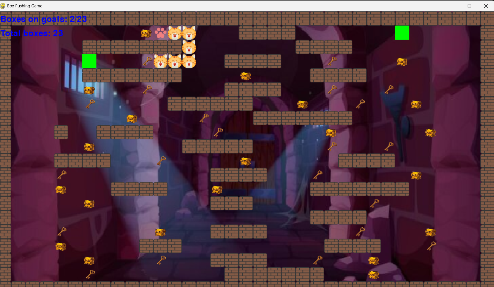

# 🎮 MINI GAME ĐẨY THÙNG – AI GỢI Ý ĐƯỜNG ĐI

> Trò chơi giải đố kinh điển được nâng cấp với AI gợi ý đường đi hộp đến đích – vừa chơi vừa luyện tư duy!

---

## ✨ Giới thiệu

Mini-game Đẩy Thùng (Sokoban) là một trò chơi tư duy nơi người chơi cần đẩy các hộp đến đúng vị trí mục tiêu trên bản đồ. Trò chơi hỗ trợ:
- 👤 Chế độ người chơi điều khiển bằng phím
- 🤖 Chế độ AI tự động giải (A*), minh họa trực quan đường đi
- 🧩 Nhiều cấp độ bản đồ: Dễ – Trung bình – Khó
---

## 💡 Tính Năng Nổi Bật

- ✅ Hỗ trợ điều khiển bằng bàn phím
- 🔁 Tùy chọn giải tự động bằng AI (A*)
- 🗺️ Sinh bản đồ ngẫu nhiên cấp độ khó
- 💾 Lưu tiến độ chơi gần nhất
- 📊 Hiển thị thống kê số hộp đúng vị trí
- 🎮 Đồ họa đơn giản dễ hiểu với các biểu tượng riêng biệt

---

## 🛠️ Công Nghệ Sử Dụng

| Thành phần         | Công nghệ                    |
|--------------------|------------------------------|
| 👾 Game Engine          | Pygame  |
| 🧠 AI tìm đường      | A* Algorithm , Hill Climbing |
| 🌄 Giao diện    | Pygame + PNG assets  |
| 🗂️ Quản lý tiến độ | Ghi vào game_progress.txt  |

---

## 📷 Giao Diện Minh Họa

 
   
   
   
 
 
   
  <strong>Chọn chế độ | Chon mức chơi | AI đang giải bằng A* | Giao diện người chơi</strong> 

---
## Ý nghĩa	Biểu tượng
- 🧱 Tường	
- 📦 Hộp	
- 🎯 Mục tiêu	
- 🍄 Người chơi	
- 🐾 Đường AI
---
## 👨‍💻 Tác Giả
- Nguyễn Viết Tiến – Thiết kế logic game, xử lý bản đồ, lập trình AI, xây dựng giao diện bằng Pygame, tích hợp thuật toán A* và Hill Climbing.
---

##🚀 Khởi Chạy Dự Án
✅ Dự án không cần cấu hình đặc biệt, chỉ cần cài pygame.bash

- git clone https://github.com/NguyenVietTien1010/GameDayThung.git
- cd GameDayThung
- pip install pygame
- python hillclimbing.py
